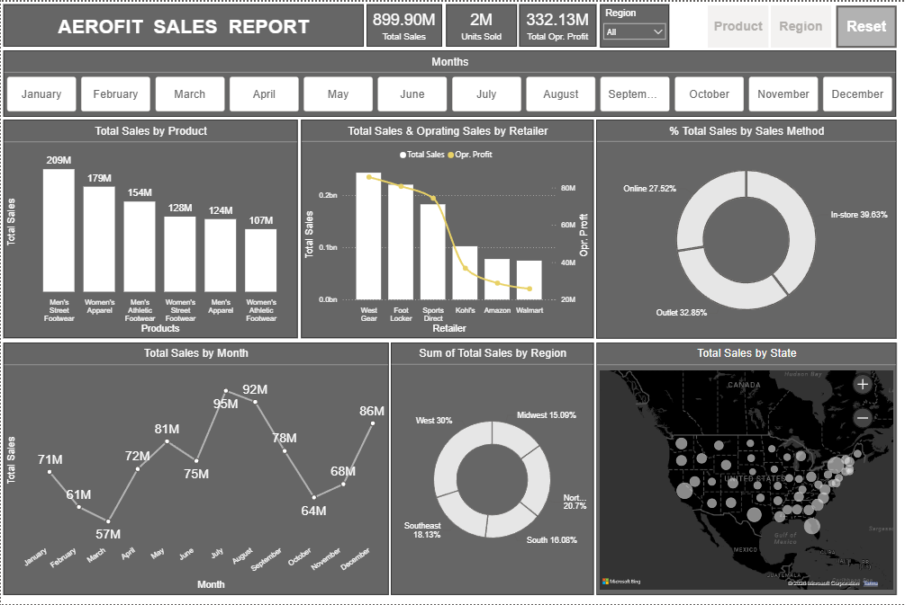
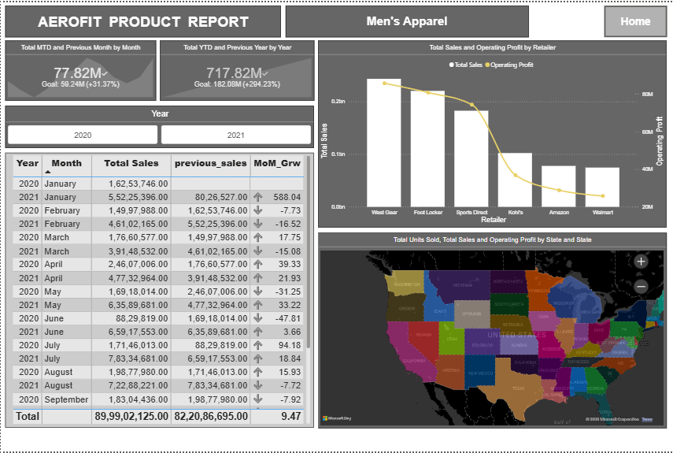
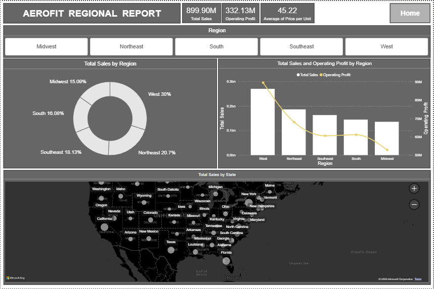

# AeroFit Sales Analysis Dashboard

Interactive Power BI dashboard for analyzing AeroFit sales performance, product trends, retailer insights, and regional analysis.

---

## Overview
This project is an interactive Power BI dashboard created to analyze AeroFit sales performance across products, retailers, regions, and sales methods.

The dashboard provides meaningful business insights using KPI cards, charts, slicers, maps, and drill-through functionality.

---

## Objectives
- Analyze overall sales performance
- Identify top-performing products and retailers
- Compare operating profit across retailers and regions
- Track monthly sales trends
- Understand regional and state-wise sales distribution
- Perform detailed drill-through analysis

---

## Tools & Technologies
- Power BI
- Power Query
- DAX
- Excel / CSV

---

# Dashboard Pages

## 1. Sales Overview Dashboard

### Features
- KPI Cards
- Monthly Sales Trend
- Product-wise Sales Analysis
- Retailer-wise Sales & Operating Profit Analysis
- Sales Method Distribution
- Region-wise Sales Distribution
- State-wise Sales Map
- Drill-through Navigation

### Key Insights
- Total sales reached 899.90M
- Sales peaked during July and August
- Men’s Street Footwear generated the highest sales
- In-store sales contributed the highest revenue
- West region contributed the highest regional sales

---

## 2. Product Performance Dashboard

### Features
- Product Drill-through Report
- Product Performance Analysis
- Year-wise Sales Comparison
- MTD & YTD KPI Analysis
- Retailer-wise Product Sales & Profit Analysis
- State-wise Product Sales Distribution

### Key Insights
- Men’s Apparel showed strong sales growth
- Sales performance varied across different years
- Higher sales resulted in better operating profit
- Product sales varied across different states

---

## 3. Regional Performance Dashboard

### Features
- Regional Drill-through Report
- Region-wise Sales Analysis
- Retailer-wise Sales Comparison
- Operating Profit Comparison by Region
- State-wise Sales Distribution Map
- Dynamic Region Filtering

### Key Insights
- West region contributed the highest sales
- Northeast region showed strong sales performance
- Sales varied across different states
- Operating profit differed across regions
- Retailer performance varied within each region

---

# Dashboard Screenshots

## Sales Overview Dashboard

## Product Performance Dashboard

## Regional Performance Dashboard

---

# Files Included
- AeroFit Sales Dashboard (.pbix)
- Business Related documents (.pdf)
- Dataset (.xlsx)
- Project Presentation (.pptx)
- Dashboard Screenshots

---

# Conclusion
This project demonstrates how interactive Power BI dashboards and drill-through analysis can be used to analyze sales performance, retailer trends, product insights, and regional business performance.

The dashboard provides meaningful business insights that can support data-driven decision-making.
